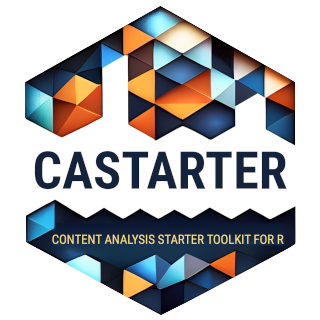

<!-- README.md is generated from README.Rmd. Please edit that file -->

```{r, include = FALSE}
knitr::opts_chunk$set(
  collapse = TRUE,
  comment = "#>",
  fig.path = "man/figures/README-",
  out.width = "100%"
)
```

# castarter <a href='https://github.com/giocomai/castarter'></a>

<!-- badges: start -->
[](https://lifecycle.r-lib.org/articles/stages.html#experimental)
<!-- badges: end -->

castarter is a more modern, fully-featured, and consistent iteration of [`castarter.legacy`](https://github.com/giocomai/castarter.legacy) - Content Analysis Starter Toolkit for the R programming language. It facilitates text mining and web scraping by taking care of many of the most common file management issues. It keeps tracks of download advancement in a local database, facilitates extraction through dedicated convenience functions, and allows for basic exploration of textual corpora through a Shiny interface.

It is currently at an early stage of development, and may behave erratically.

## Installation

You can install `castarter` with:

``` r
remotes::install_github("giocomai/castarter")
```

## Key features

`castarter` aims to streamline the process of aquiring textual contents retrieved online and transforming them into a structured format ready to be analysed.

It facilitates many of the tasks that often pose an excessive hurdle for beginners and are unnecessarily time consuming even for experienced users:

- creating list of URLs from sections of a website
- managing the download process by
  - ensuring pages are downloaded only once
  - managing the creation of folders and subfolders
  - keeping a log of the download process for reporting
- extracting text and metadata from the downloaded files, including support for different formats, including html (default), json, xml, and csv
- keeping extracted text in a database in order to allow further analysis even if the resulting dataset is larger than available memory
- keeping a textual dataset updated
- sharing a textual dataset with the wider public through a web interface that enables basic analaysis of the corpus
- conducting basic quality and sanity checks on the textual dataset
- exporting the dataset to common formats
- making backup of files, and storing them to a remote location
- producing reports about the download process, including basic summary statistics

This package allows for many custom options for advanced users, but is still opinionated about how a typical workflow looks like and about the likely user preferences. More broadly, a core idea is that reliability is more important than speed, as more advanced users can then export the data in more efficient formats. 


## Key concepts

### Project and website

One of the first issues that appear when starting a text mining or web scraping project relates to the issue of managing files and folder. `castarter` defaults to an opinionated folder structure that should work for most projects. It also facilitates downloading files (skipping previously downloaded files) and ensuring consistent and unique matching between a downloaded html, its source url, and data extracted from them. Finally, it facilitates archiving and backuping downloaded files and scripts.

The folder structure is based on two levels:

- project
- website

A project may include one or more websites. It is an intermediate level added to keep files in order, as the number of processed websites increased. 

Let's clarify with an example. Let's suppose I want to do some text minining of websites related to the European Union. The name of the project will be `european_union`, and within that project I may be gathering contents from different websites, e.g. "european_commission", "european_parliament", "european_council", etc. 

```{r}
library("castarter")
cas_set_options(base_folder = fs::path(fs::path_home_r(), "R", "castarter_data"),
                project = "european_union",
                website = "european_commission"
)

```

Assuming that my project on the European Union involves text mining the website of the European Council, the European Commission, and the European Parliament, the folder structure may look something like this:


```{r eval = TRUE, include = FALSE}
fs::dir_create(path = fs::path(cas_get_options()$base_folder,
                               cas_get_options()$project,
                               cas_get_options()$website))

fs::dir_create(path = fs::path(cas_get_options()$base_folder,
                               cas_get_options()$project,
                               "european_parliament"))

fs::dir_create(path = fs::path(cas_get_options()$base_folder,
                               cas_get_options()$project,
                               "european_council"))

fs::dir_tree(cas_get_options()$base_folder)
```


In brief, `castarter_data` is the base folder where I can store all of my text mining projects. `european_union` is the name of the project, while all others are the names of the specific websites I will source. Folders will be created automatically as needed when you start downloading files. 


When text mining or scraping, it is common to gather quickly many thousands of file, and keeping them in good order is fundamental, particularly in the long term. Hence, a preliminary suggestion: depending on how you usually work and keep your files backed-up it may make sense to keep your scripts in a folder that is live-synced (e.g. with services such as Dropbox, Nextcloud, or Google Drive). It however rarely make sense to live-sync tens or hundreds of thousands of files as you proceed with your scraping. You may want to keep this in mind as you set the `base_folder` with `cas_set_options()`. 

`castarter` stores details about the download process in a database. By default, this is stored locally in RSQlite database kept in the same folder as website files, but it can be stored in a different folder, or alternative database backends such as MySQL can also be used. 

### Index pages and content pages

`castarter` starts with the idea that there are basically two types of pages that are commonly found when text mining. 

__index pages__. These are pages that usually include some form of list of the pages with actual contents we are interested in (or, possibly, a second layer of index pages). They can be immutable, but they are often expected to change. For example, the news archive of the official website of Russia's president is reachable via url such as the following:

- http://en.kremlin.ru/events/president/news/page/1 (the latest posts published)
- http://en.kremlin.ru/events/president/news/page/2 (previous posts)
- http://en.kremlin.ru/events/president/news/page/3
- ...
- http://en.kremlin.ru/events/president/news/page/1000 (posts published more than 15 years ago)
- ...

This is a structure that is common to many websites. In such cases, if we intend to keep our text mining efforts up to date, we usually would want to download the first such pages again and again, as long as we find new links that are not in our previous dataset. 

__content pages__. These are pages that include the actual content we are interested in. These have urls such as:

- http://en.kremlin.ru/events/president/news/67586

Some section of the page may change, but our default expectation is that the part of the page we are interested in does not change. Unless we have some specific reason to do otherwise, we usually need to download such pages only once.

## Interactive exploration of textual datasets

Check out `castarter`'s interactive web interface for exploring corpora.

```{r example, eval = FALSE}
library("castarter")
remotes::install_github("giocomai/tifkremlinen")
cas_explorer(corpus = tifkremlinen::kremlin_en,
             default_string = "Syria, Crimea")
```


## Vignettes

### Workflow

See `vignette("castarter-workflow")`

### Database structure

See `vignette("castarter-database")`

### Data quality issues

See `vignette("integrity")`

### Shiny modules

See `vignette("castarter-shiny-modules")`

## Forthcoming features

- comprehensive documentation
- make `castarter` download files in the background (e.g. with callr, or rstudio jobs)
- more options for analysis: peaks, periods, etc.

## License

`castarter` is released with a MIT license. 
