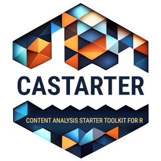

<!-- README.md is generated from README.Rmd. Please edit that file -->

# castarter <a href='https://github.com/giocomai/castarter'></a>

<!-- badges: start -->

[](https://lifecycle.r-lib.org/articles/stages.html#experimental)
<!-- badges: end -->

`castarter` - Content Analysis Starter Toolkit for the R programming
language - facilitates text mining and web scraping by taking care of
many of the most common file management and parsing issues. It keeps
tracks of download advancement in a local database, facilitates
extraction through dedicated convenience functions, and allows for basic
exploration of textual corpora through a Shiny interface. `castarter` is
a more modern, fully-featured, and consistent iteration of
[`castarter.legacy`](https://github.com/giocomai/castarter.legacy)

## Key features

`castarter` aims to streamline the process of aquiring textual contents
retrieved online and transforming them into a structured format ready to
be analysed. It can also be used for scraping data or for consistently
downloading files.

It facilitates many of the tasks that often pose an excessive hurdle for
beginners and are unnecessarily time consuming even for experienced
users:

- creating list of URLs from sections of a website
- extracting links from index pages
- managing the download process by
  - ensuring pages are downloaded only once
  - managing the creation of folders and subfolders
  - keeping a log of the download process for reporting
- extracting text and metadata from the downloaded files, including
  support for different formats, including html (default), json, xml,
  and csv
- keeping extracted text in a database in order to allow further
  analysis even if the resulting dataset is larger than available memory
- keeping a textual dataset updated
- sharing a textual dataset with the wider public through a web
  interface that enables basic analaysis of the corpus
- conducting basic quality and sanity checks on the textual dataset
- exporting the dataset to common formats
- making backup of files, and storing them to a remote location
- producing reports about the download process, including basic summary
  statistics

This package allows for many custom options for advanced users, but is
still opinionated about how a typical workflow looks like and about the
likely user preferences. More broadly, a core idea is that reliability
is more important than speed, as more advanced users can process or
export data with their own custom solutions.

## Installation

You can install `castarter` with:

``` r
remotes::install_github(repo = "giocomai/castarter", dependencies = TRUE)
```

If this does not work or you have issues, consider using just:

``` r
remotes::install_github(repo = "giocomai/castarter")
```

if you intend to use `castarter` to manage download and extraction of
contents or data from files, but not for their further analysis.

This latter option may also be helpful on some operating systems,
including some Linux versions, where installing `arrow` may be
time-consuming or may not work. Indeed, for its corpus-processing
functions, `castarter` effectively depends on the `arrow` package, which
allows for memory-efficient processing of datasets. It is however only
included among suggested packages, as its installation may not be
straightforward on some systems, and because it is not necessary for
most `castarter` functions.

`arrow`’s own documentation has a dedicated page for [troubleshooting
its
installation](https://arrow.apache.org/docs/r/articles/install.html). In
my experience, the more consistently successful approach relies on [a
custom install script advertised in the above
page](https://arrow.apache.org/docs/r/articles/install.html#using-install_arrow)
by the package developers. It can be run as follows:

``` r
source("https://raw.githubusercontent.com/apache/arrow/main/r/R/install-arrow.R")
install_arrow()
```

## Workflow and how-to

Detailed documentation of workflow and on how to deal with various
scenarios is only partly available.

To get an idea of how `castarter` works you should check out the [Key
concepts](articles/0-key-concepts.html) article (also included below for
reference) and have a look at one of the workflow examples.

### Workflow examples

- a [full
  walkthrough](https://tadadit.xyz/tutorials/2023-02-kremlin_ru_en_extract/)
  of extracting textual contents on a website, with code and a detailed
  explanation of the process
- an [additional example](articles/castarter-workflow.html), with full
  code but only partial explanation of the process

## Step-by-step

- [0. Key concepts](articles/0-key-concepts.html)
- [1. Getting index files](articles/1-getting-index.html)
- [2. Extracting links](articles/2-extracting-links.html)
- [3. Downloading files](articles/3-downloading-files.html)
- [4. Extracting contents](articles/4-extracting-contents.html)
- [5. Data exploration and
  analysis](articles/5-data-exploration-analysis.html)
- [6. Data quality](articles/6-data-quality.html)
- [7. File management and
  archiving](articles/7-archiving-file-management.html)

The section on key concepts is also included in this readme below.

## Key concepts

### Project and website

One of the first issues that appear when starting a text mining or web
scraping project relates to the issue of managing files and folder.
`castarter` defaults to an opinionated folder structure that should work
for most projects. It also facilitates downloading files (skipping
previously downloaded files) and ensuring consistent and unique matching
between a downloaded html, its source url, and data extracted from them.
Finally, it facilitates archiving and backuping downloaded files and
scripts.

The folder structure is based on two levels:

- project
- website

A project may include one or more websites. It is an intermediate level
added to keep files in order, as the number of processed websites
increased.

Let’s clarify with an example. Let’s suppose I want to do some text
minining of websites related to the European Union. The name of the
project will be `european_union`, and within that project I may be
gathering contents from different websites, e.g. “european_commission”,
“european_parliament”, “european_council”, etc.

``` r
library("castarter")
cas_set_options(
  base_folder = fs::path(fs::path_temp(), "castarter_data"),
  project = "european_union",
  website = "european_commission"
)
```

Assuming that my project on the European Union involves text mining the
website of the European Council, the European Commission, and the
European Parliament, the folder structure may look something like this:

    #> /tmp/Rtmp5TSS8d/castarter_data
    #> └── european_union
    #>     ├── european_commission
    #>     ├── european_council
    #>     └── european_parliament

In brief, `castarter_data` is the base folder where I can store all of
my text mining projects. `european_union` is the name of the project,
while all others are the names of the specific websites I will source.
Folders will be created automatically as needed when you start
downloading files.

When text mining or scraping, it is common to gather quickly many
thousands of file, and keeping them in good order is fundamental,
particularly in the long term. Hence, a preliminary suggestion:
depending on how you usually work and keep your files backed-up it may
make sense to keep your scripts in a folder that is live-synced
(e.g. with services such as Dropbox, Nextcloud, or Google Drive). It
however rarely make sense to live-sync tens or hundreds of thousands of
files as you proceed with your scraping. You may want to keep this in
mind as you set the `base_folder` with `cas_set_options()`.

`castarter` stores details about the download process in a database. By
default, this is stored locally in RSQlite database kept in the same
folder as website files, but it can be stored in a different folder, or
alternative database backends such as MySQL can also be used.

### Index pages and content pages

`castarter` starts with the idea that there are basically two types of
pages that are commonly found when text mining.

**index pages**. These are pages that usually include some form of list
of the pages with actual contents we are interested in (or, possibly, a
second layer of index pages). They can be immutable, but they are often
expected to change. For example, the news archive of the official
website of Russia’s president is reachable via url such as the
following:

- <http://en.kremlin.ru/events/president/news/page/1> (the latest posts
  published)
- <http://en.kremlin.ru/events/president/news/page/2> (previous posts)
- <http://en.kremlin.ru/events/president/news/page/3>
- …
- <http://en.kremlin.ru/events/president/news/page/1000> (posts
  published more than 15 years ago)
- …

This is a structure that is common to many websites. In such cases, if
we intend to keep our text mining efforts up to date, we usually would
want to download the first such pages again and again, as long as we
find new links that are not in our previous dataset.

**content pages**. These are pages that include the actual content we
are interested in. These have urls such as:

- <http://en.kremlin.ru/events/president/news/67586>

Some section of the page may change, but our default expectation is that
the part of the page we are interested in does not change. Unless we
have some specific reason to do otherwise, we usually need to download
such pages only once.

## Interactive exploration of textual datasets

Check out `castarter`’s interactive web interface for exploring corpora.

``` r
library("castarter")
remotes::install_github("giocomai/tifkremlinen")
cas_explorer(
  corpus = tifkremlinen::kremlin_en,
  default_pattern = "Syria, Crimea"
)
```

## Technical details about the implementation

### Database structure

See `vignette("castarter-database")`

### Shiny modules

See `vignette("castarter-shiny-modules")`

## Forthcoming features

- comprehensive documentation
- make `castarter` download files in the background (e.g. with callr, or
  rstudio jobs)
- more options for analysis: peaks, periods, etc.

## Coding conventions and package design principles

Function naming conventions:

- functions should start with the prefix `cas_` and should be followed
  my a verb
- functions that call Shiny apps start with the prefix `cass_`, with the
  additional *s* referring to Shiny
- empty datasets demonstrating the expected output of functions
  retrieving data from databases start with `casdb_empty_`

Long term, the package should follow best practices as described in
[*Tidy Design Principles*](https://design.tidyverse.org/), including in
particular:

- [most important arguments should be
  first](https://design.tidyverse.org/important-args-first.html)

- [required args shouldn’t have
  defaults](https://design.tidyverse.org/required-no-defaults.html)

- [… should come after required
  arguments](https://design.tidyverse.org/dots-after-required.html)

- informative messages are given in functions relying on `cli`,
  e.g. `cli::cli_inform()` (code relying on `usethis` for this purpose
  is hence to be considered legacy code to be fixed)

## License

`castarter` is released with a MIT license.
