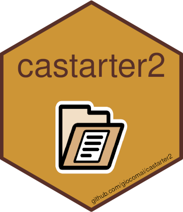

<!-- README.md is generated from README.Rmd. Please edit that file -->

# castarter2 <a href='https://github.com/giocomai/castarter2'></a>

<!-- badges: start -->

[](https://lifecycle.r-lib.org/articles/stages.html#experimental)
<!-- badges: end -->

castarter2 is a more modern, fully-featured, and consistent iteration of
[`castarter`](https://github.com/giocomai/castarter) - Content Analysis
Starter Toolkit for the R programming language. It facilitates text
mining and web scraping by taking care of many of the most common file
management issues, keeps tracks of download advancement in a local
database, facilitates extraction through dedicated convenience
functions, and allows for basic exploration of textual corpora through a
Shiny interface.

It is currently at an early stage of development, and will likely behave
erratically.

## Installation

You can install `castarter2` with:

``` r
remotes::install_github("giocomai/castarter2")
```

## Interactive exploration of textual corpora

Check out `castarter2`’s interactive web interface for exploring
corpora.

``` r
remotes::install_github("giocomai/tifkremlinen")
cas_explorer(corpus = tifkremlinen::kremlin_en,
             default_string = "Syria, Crimea")
```

# Key concepts

## Project and website

One of the first issues that appear when starting a text mining or web
scraping project relates to the issue of managing files and folder.
`castarter2` defaults to an opinionated folder structure that should
work for most projects. It also facilitates downloading files (skipping
previously downloaded files) and ensuring consistent and unique matching
between a downloaded html, its source url, and data extracted from them.
Finally, it facilitates archiving and backuping downloaded files and
scripts.

The folder structure is based on two levels:

-   project
-   website

A project may include one or more websites. It is an intermediate level
added to keep files in order, as the number of processed websites
increased.

Let’s clarify with an example. Let’s suppose I want to do some text
minining of websites related to the European Union. The name of the
project will be `european_union`, and within that project I may be
gathering contents from different websites, e.g. “european_commission”,
“european_parliament”, “european_council”, etc.

``` r
library("castarter2")
cas_set_options(base_folder = fs::path(fs::path_home_r(), "R", "castarter_data"),
                project = "european_union",
                website = "european_commission"
)
```

Assuming that my project on the European Union involves text mining the
website of the European Council, the European Commission, and the
European Parliament, the folder structure may look something like this:

In brief, `castarter_data` is the base folder where I can store all of
my text mining projects. `european_union` is the name of the project,
while all others are the names of the specific websites I will source.
Folders will by created automatically as needed when you start
downloading files.

When text mining or scraping, it is common to gather quickly many
thousands of file, and keeping them in good order is fundamental,
particularly in the long term. Hence, a preliminary suggestion:
depending on how you usually work and keep your files backed-up it may
make sense to keep your scripts in a folder that is live-synced
(e.g. with services such as Dropbox, Nextcloud, or Google Drive). It
however rarely make sense to live-sync tens or hundreds of thousands of
files as you proceed with your scraping. You may want to keep this in
mind as you set the `base_folder` with `cas_set_options()`.

`castarter2` stores details about the download process in a database. By
default, this is stored locally in RSQlite database kept in the same
folder as website files, but it can be stored in a different folder, or
alternative database backends such as MySQL can also be used.

## Index pages and content pages

`castarter2` starts with the idea that there are basically two types of
pages that are commonly found when text mining.

**index pages**. These are pages that usually include some form of list
of the pages with actual contents we are interested in (or, possibly, a
second layer of index pages). They can be immutable, but they are often
expected to change. For example, the news archive of the official
website of Russia’s president is reachable via url such as the
following:

-   <http://en.kremlin.ru/events/president/news/page/1> (the latest
    posts published)
-   <http://en.kremlin.ru/events/president/news/page/2> (previous posts)
-   <http://en.kremlin.ru/events/president/news/page/3>
-   …
-   <http://en.kremlin.ru/events/president/news/page/1000> (posts
    published more than 15 years ago)
-   …

This is a structure that is common to many websites. In such cases, if
we intend to keep our text mining efforts up to date, we usually would
want to download the first such pages again and again, as long as we
find new links that are not in our previous dataset.

**content pages**. These are pages that include the actual content we
are interested in. These have urls such as:

-   <http://en.kremlin.ru/events/president/news/67586>

Some section of the page may change, but our default expectation is that
the part of the page we are interested in does not change. Unless we
have some specific reason to do otherwise, we usually need to download
such pages only once.

## Database

To keep track of the urls we are working on, `castarter2` facilitates
storing urls, as well as some basic metadata about them, in an orderly
fashion.

These are the key tables to found in a `castarter2` database:

-   `index_id` - a table with three columns:

    -   `id`: a unique integer identifier corresponding to a unique url
    -   `url`: a url
    -   `type`: a textual string, by default `index`. It is not
        infrequent to have separate index pages for different sections
        of a website (e.g. “news”, “events”, “statements”, etc.),
        different tags, or different levels of the indexing process
        (they can, for example, be called `step_01`, `step_02`). In such
        cases, it is useful to separate these different types of sources
        in case of updates: one would be interested in downloading the
        latest `example.com/news/page/1` and the latest
        `example.com/statements/page/1`, and following, but not
        necessarily all index pages.

-   `index_download` - a table with four columns. New rows appear here
    only when a download has been attempted.

    -   `id`: an integer, matching the identifier defined in the
        previous table
    -   `datetime`: timestamp of when download was attempted
    -   `status`: http response status code, such as 200 for successful,
        404 for not found,
        [etc](https://en.wikipedia.org/wiki/List_of_HTTP_status_codes).
    -   `size`: size of the downloaded file

-   `contents_id`- a table with three columns, similar to the one
    outlined above:

    -   `id`: a unique integer identifier corresponding to a unique url
    -   `url`: a url
    -   `type`: this reflect the type defined in the `index_id` table,
        may or may not be useful

-   `contents_download` - a table with four columns, similar to the one
    outlined above. New rows appear here only when a download has been
    attempted.

    -   `id`: an integer, matching the identifier defined in the
        `contents_id` table
    -   `datetime`: timestamp of when download was attempted
    -   `status`: http response status code, such as 200 for successful,
        404 for not found,
        [etc](https://en.wikipedia.org/wiki/List_of_HTTP_status_codes).
    -   `size`: size of the downloaded file

-   `contents_data` - a table with three columns

    -   `id` - an integer, matching the identifier defined in the
        `contents_id` table
    -   `field` - a character string, defining a value type. These often
        will include fields such as “title”, “date”, “author”, “text”,
        etc., but are not limited by design. Irrespective of their
        contents, they will however all be stored as textual strings.

# Workflow

## What currently works

``` r
cas_set_options(base_folder = fs::path(fs::path_home_r(), "R", "castarter_data"),
                project = "european_union",
                website = "european_commission"
)
```

# To do

## Getting files

-   make castarter download files in the background
    -   with callr
    -   possibly, via rstudio jobs

## Time series

-   more options for analysis: peaks, periods, etc.
